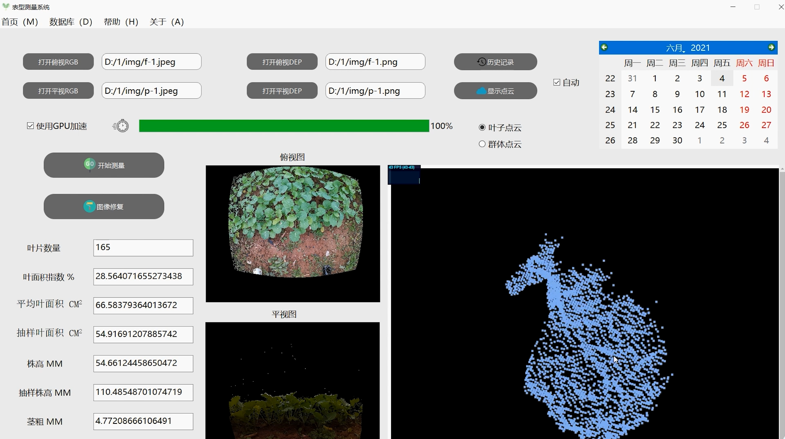

## 作物表型测量软件

1. 使用pyqt作为ui框架
2. 测量用到AzureKinect拍摄的rgb-d图像，使用tensorflow训练的u-net和deeplab-v3进行分割，剔除土壤。
3. 叶片的实例分割采用的传统cv算法：分水岭，在边缘检测后的注水点处结合深度图测量8个位置的深度值并计算方差，剔除一部分方差较小的边缘点（可认为是叶脉等假边缘点）
4. 基于opencv添加了交互选择叶片测量面积的功能
5. 作物的三维表型，如叶面积，使用点云库PCL进行测量
6. 使用three.js进行叶片点云的显示
7. 支持历史记录、excel表格的导出
8. 调用tensorflow模型时，使用QThread多线程。

